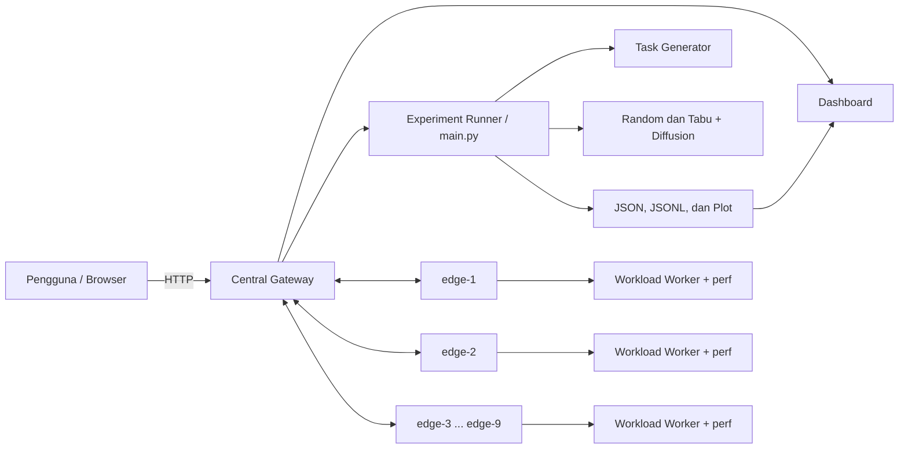
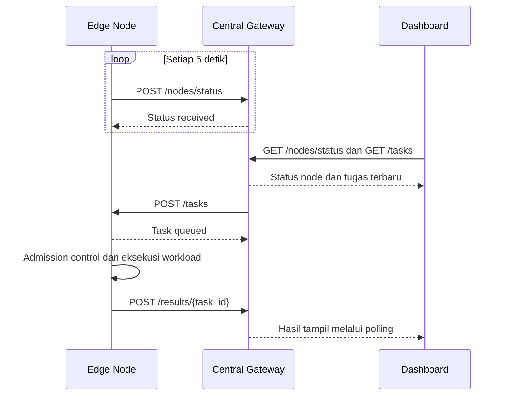
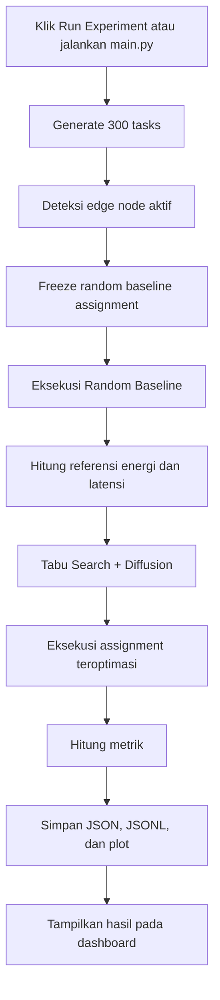

# Alur Sistem dan Script Demonstrasi Sidang

Dokumen ini menjelaskan alur kerja sistem edge computing dan menyediakan naskah
demonstrasi yang dapat dibacakan atau disesuaikan saat sidang.

## 1. Ringkasan Sistem

Sistem terdiri dari satu **central gateway** dan sembilan **edge node**.

- Central gateway menyediakan dashboard, menerima heartbeat, memantau tugas,
  menjalankan eksperimen, dan menampilkan hasil.
- Edge node menerima tugas, mengantrekannya, menjalankan workload CPU dan
  memori, lalu mengirim hasil kembali ke central gateway.
- Eksperimen membandingkan penempatan tugas **Random** dengan penempatan hasil
  optimasi **Tabu Search + Diffusion**.
- Metrik utama yang dibandingkan adalah latensi dan estimasi energi.

Konfigurasi utama saat ini:

| Komponen | Alamat/port |
|---|---|
| Central gateway | `10.33.102.106:8000` |
| Edge node | `edge-1` sampai `edge-9` |
| Port edge node | `8001` sampai `8009` |
| Jumlah tugas eksperimen | 300 tugas |
| Jenis workload | `cpu_mem_burn` |

Detail IP setiap node mengikuti `config.py`.

## 2. Arsitektur



### Komponen utama

| File/komponen | Tanggung jawab |
|---|---|
| `central/gateway.py` | API pusat, dashboard, heartbeat, status tugas, dan pemicu eksperimen |
| `central/web/dashboard.html` | Visualisasi status node, progres eksperimen, dan hasil |
| `main.py` | Orkestrasi eksperimen Random dan Tabu + Diffusion |
| `central/task_generator.py` | Membuat batch tugas CPU dan memori |
| `central/offline_runner.py` | Mengirim tugas sesuai assignment dan mengumpulkan hasil |
| `central/assignment_engine.py` | Membentuk assignment hasil optimasi |
| `central/optimizer_runner.py` | Proses utama Tabu Search hibrida |
| `central/local_optimizers.py` | Perbaikan lokal menggunakan Diffusion |
| `edge/edge_node.py` | Antrean, admission control, eksekusi, heartbeat, dan pengiriman hasil |
| `edge/workload_worker.py` | Workload CPU dan memori yang benar-benar dijalankan |
| `central/node_resources.py` | Kapasitas CPU, memori, delay, dan profil daya setiap node |

## 3. Dua Alur yang Perlu Dibedakan

### 3.1 Alur layanan real-time

Alur ini menjelaskan komunikasi central gateway dengan edge node.



1. Setiap edge node mengirim heartbeat ke central gateway setiap lima detik.
2. Heartbeat berisi penggunaan CPU, memori, jumlah tugas, dan timestamp.
3. Dashboard melakukan polling API setiap 1,5 detik.
4. Ketika tugas diterima, edge node memasukkannya ke antrean.
5. Dispatcher hanya menjalankan tugas jika kapasitas CPU, memori, dan batas
   concurrency mengizinkan.
6. Workload dijalankan melalui `workload_worker.py` dan diukur menggunakan
   Linux `perf`.
7. Edge node mengirim status `completed` atau `failed` ke central gateway.

### 3.2 Alur eksperimen pembanding



#### Tahap 1: Pembangkitan tugas

`main.py` membuat 300 tugas dengan karakteristik:

- target waktu CPU;
- kebutuhan memori;
- `cpu_demand`;
- `memory_demand`;
- kategori small, medium, atau large.

Generator menggunakan data kalibrasi bila tersedia. Jika tidak tersedia,
generator menggunakan distribusi teoritis.

#### Tahap 2: Random baseline

Assignment random dibuat dengan seed tetap sehingga eksperimen dapat diulang
secara lebih konsisten. Tugas kemudian benar-benar dikirim ke edge node aktif.
Hasil tahap ini menjadi baseline pembanding.

#### Tahap 3: Tabu Search + Diffusion

Tabu Search mencari kombinasi penempatan tugas dengan objective gabungan.
Secara umum objective mempertimbangkan:

- estimasi energi;
- estimasi latensi;
- tekanan sumber daya atau potensi overload.

Konfigurasi saat ini menggunakan bobot energi `0.5` dan bobot latensi `0.5`,
kecuali diubah melalui environment variable.

Tabu Search menggunakan memori tabu agar pencarian tidak berulang pada solusi
yang baru dikunjungi. Ketika pencarian stagnan, Diffusion melakukan perbaikan
lokal dengan mengevaluasi pemindahan tugas ke node tetangga yang memberikan
biaya lokal lebih baik.

#### Tahap 4: Eksekusi assignment teroptimasi

Assignment terbaik dari optimizer digunakan untuk menjalankan batch tugas yang
sama. Dengan demikian, perbedaan hasil berasal dari strategi penempatan, bukan
dari perubahan jumlah atau karakteristik tugas.

#### Tahap 5: Pengukuran dan penyimpanan hasil

Metrik yang disimpan meliputi:

- rata-rata dan total latensi aktual;
- rata-rata dan total execution time;
- estimasi energi dalam Joule;
- base energy;
- high-power penalty;
- task clock dan CPU clock;
- penggunaan memori;
- distribusi tugas per node;
- histori objective setiap iterasi.

Output disimpan pada:

```text
outputs/runs/          # JSON hasil dan gambar plot
outputs/calibration/   # Dataset kalibrasi JSONL
outputs/logs/          # Log eksperimen dari tombol dashboard
```

## 4. Cara Menjelaskan Dashboard

| Bagian dashboard | Penjelasan |
|---|---|
| Gateway Online | Central gateway dapat diakses |
| Online Nodes | Node yang heartbeat-nya masih fresh |
| Active Tasks | Tugas pending, queued, atau processing |
| Completed/Failed | Akumulasi hasil tugas |
| Live CPU | Rata-rata CPU berbobot kapasitas node aktif |
| Random Run | Eksekusi baseline random |
| Optimization | Proses pencarian Tabu + Diffusion |
| Optimized Result Run | Eksekusi assignment terbaik |
| Node Cards | CPU, memori, antrean, dan status tiap node |
| Distribution | Jumlah tugas yang ditempatkan pada setiap node |
| Latest Completed Run | Metrik dan plot eksperimen terakhir |

Catatan penting: **Gateway Online tidak otomatis berarti semua edge node
online**. Status setiap node ditentukan dari heartbeat masing-masing.

## 5. Persiapan Sebelum Sidang

Lakukan checklist ini minimal 15–30 menit sebelum demonstrasi.

### Central gateway

```bash
cd /home/adinda-central/edge

curl http://127.0.0.1:8000/health
curl http://127.0.0.1:8000/nodes/status
```

Jika gateway belum berjalan:

```bash
cd /home/adinda-central/edge
tmux new-session -d -s adinda-gateway \
  'cd /home/adinda-central/edge && exec venv/bin/python central/gateway.py'
```

### Mengecek dan Mengelola Port

Central gateway menggunakan port `8000`, sedangkan edge node menggunakan port
`8001` sampai `8009`.

#### Cek proses yang menggunakan port

Gunakan salah satu perintah berikut:

```bash
sudo ss -ltnp | grep ':8000'
```

atau:

```bash
sudo lsof -nP -iTCP:8000 -sTCP:LISTEN
```

Untuk mengecek seluruh port central dan edge node:

```bash
sudo ss -ltnp | grep -E ':800[0-9]'
```

Contoh hasil:

```text
LISTEN 0 2048 0.0.0.0:8000 0.0.0.0:* users:(("python",pid=12345,fd=6))
```

Angka setelah `pid=` adalah PID proses yang memakai port tersebut.

Untuk melihat detail proses berdasarkan PID:

```bash
ps -fp 12345
```

Ganti `12345` dengan PID yang ditemukan. Pastikan proses tersebut benar-benar
gateway atau edge node milik sistem ini sebelum menghentikannya.

#### Menghentikan proses pada port

Hentikan proses secara normal terlebih dahulu:

```bash
kill 12345
```

Periksa kembali port:

```bash
sudo ss -ltnp | grep ':8000'
```

Jika proses tidak berhenti setelah beberapa detik, gunakan:

```bash
kill -9 12345
```

`kill -9` hanya digunakan sebagai pilihan terakhir karena proses tidak mendapat
kesempatan melakukan cleanup.

Alternatif satu baris khusus port `8000`:

```bash
sudo fuser -k 8000/tcp
```

Perintah `fuser -k` langsung menghentikan proses yang menggunakan port. Jangan
jalankan sebelum memastikan port yang dipilih benar.

Jika gateway berjalan di dalam `tmux`, lebih baik hentikan berdasarkan nama
session:

```bash
tmux list-sessions
tmux kill-session -t adinda-gateway
```

#### Menjalankan gateway manual dengan log di terminal

Buka terminal pertama:

```bash
cd /home/adinda-central/edge
venv/bin/python central/gateway.py
```

Alternatif menggunakan Uvicorn:

```bash
cd /home/adinda-central/edge
venv/bin/python -m uvicorn central.gateway:app \
  --host 0.0.0.0 \
  --port 8000 \
  --log-level info
```

Gateway berjalan di foreground sehingga heartbeat, task submission, perubahan
fase eksperimen, dan error akan terlihat langsung di terminal. Biarkan terminal
ini tetap terbuka. Tekan `Ctrl+C` untuk menghentikan gateway secara normal.

#### Menjalankan `main.py` manual dengan log di terminal

Pastikan gateway dan seluruh edge node sudah berjalan. Buka terminal kedua:

```bash
cd /home/adinda-central/edge
venv/bin/python main.py
```

Terminal kedua akan menampilkan:

- ID eksperimen;
- konfigurasi objective;
- assignment tugas;
- progres Random Run;
- proses Tabu + Diffusion;
- progres Optimized Result Run;
- metrik dan lokasi file output.

Tekan `Ctrl+C` hanya jika eksperimen memang perlu dibatalkan. Setelah dibatalkan,
periksa proses berikut untuk memastikan tidak ada `main.py` yang tertinggal:

```bash
pgrep -af 'python.*main.py'
```

Jika masih ada, baca PID dari output, periksa dengan `ps -fp PID`, lalu hentikan
menggunakan `kill PID`.

#### Susunan terminal yang disarankan saat sidang

1. **Terminal 1:** central gateway foreground.
2. **Terminal 2:** menjalankan `main.py`.
3. **Browser:** dashboard `http://10.33.102.106:8000`.
4. **Terminal tambahan:** pengecekan port, node, atau SSH jika diperlukan.

Dengan susunan ini, dashboard menunjukkan visualisasi, sedangkan terminal
menunjukkan log proses yang berlangsung secara langsung.

### Edge node

Pada masing-masing perangkat:

```bash
cd ~/edge
./run_edge_node.sh
```

Pastikan:

- hostname sesuai `adinda1` sampai `adinda9`;
- `perf` tersedia;
- central dan edge node berada pada jaringan yang sama;
- dashboard menampilkan `9/9 online`;
- tidak ada eksperimen lama yang masih berjalan.

### Browser

Buka:

```text
http://10.33.102.106:8000
```

Refresh halaman dan pastikan tombol **Run Experiment** aktif.

## 6. Script Demonstrasi Sidang

Naskah berikut dirancang untuk demonstrasi sekitar 8–12 menit.

### Bagian A — Pembukaan

> Pada demonstrasi ini saya akan menunjukkan sistem edge computing yang terdiri
> dari satu central gateway dan sembilan edge node. Tujuan sistem ini adalah
> membandingkan strategi penempatan tugas secara random dengan strategi
> optimasi Tabu Search yang dikombinasikan dengan Diffusion.

> Fokus evaluasinya adalah melihat pengaruh strategi penempatan terhadap
> latensi dan estimasi konsumsi energi pada node yang memiliki kapasitas
> berbeda.

### Bagian B — Menjelaskan arsitektur

**Aksi:** Tampilkan dashboard tanpa menjalankan eksperimen terlebih dahulu.

> Halaman ini dilayani oleh central gateway. Central gateway berfungsi sebagai
> pusat monitoring, penerima heartbeat, pengelola status tugas, serta pemicu
> eksperimen.

> Di sisi edge terdapat sembilan node. Setiap node menjalankan FastAPI,
> memiliki antrean tugas dan admission control, kemudian mengirim heartbeat
> setiap lima detik ke central.

**Aksi:** Tunjuk indikator Gateway Online dan Online Nodes.

> Indikator Gateway Online menunjukkan layanan pusat aktif. Sementara itu,
> jumlah Online Nodes berasal dari heartbeat. Node dianggap tidak aktif jika
> heartbeat melewati batas freshness yang ditentukan sistem.

### Bagian C — Menjelaskan heterogenitas node

**Aksi:** Scroll atau tunjukkan kartu edge-1 sampai edge-9.

> Node pada sistem ini bersifat heterogen. Edge-1 sampai edge-3 berada pada
> kelompok kapasitas rendah, edge-4 sampai edge-6 kapasitas menengah, dan
> edge-7 sampai edge-9 kapasitas tinggi.

> Node berkapasitas tinggi dapat menyelesaikan beban lebih cepat, tetapi profil
> dayanya juga lebih besar. Karena itu, menempatkan semua tugas pada node
> tercepat belum tentu menghasilkan energi terbaik. Di sinilah optimasi
> multi-objective diperlukan.

### Bagian D — Menjalankan eksperimen

**Aksi:** Klik **Run Experiment**, lalu konfirmasi.

> Saya menjalankan eksperimen melalui dashboard. Tombol ini memanggil endpoint
> central gateway yang menjalankan `main.py` sebagai background process.
> `main.py` tetap dapat dijalankan langsung dari terminal, sehingga antarmuka
> web hanya menjadi cara tambahan untuk memulai eksperimen.

> Sistem terlebih dahulu membangkitkan 300 tugas CPU dan memori. Batch tugas
> yang sama digunakan untuk kedua strategi agar perbandingan tetap adil.

### Bagian E — Random baseline

**Aksi:** Tunjuk tahap **Random Run**, task counter, distribution, dan CPU.

> Tahap pertama adalah Random Run. Pada tahap ini, tugas ditempatkan berdasarkan
> assignment random dengan seed yang dibekukan. Assignment tersebut kemudian
> dieksekusi pada edge node nyata.

> Setiap node menerima tugas melalui endpoint `/tasks`. Tugas masuk ke antrean,
> diperiksa oleh admission control, kemudian workload CPU dan memori dijalankan.
> Linux `perf` digunakan untuk mengambil task-clock dan cpu-clock.

> Dashboard menerima pembaruan melalui polling, sedangkan edge node mengirim
> hasil eksekusi kembali ke central gateway.

### Bagian F — Proses optimasi

**Aksi:** Saat indikator berpindah ke **Optimization**, tunjuk tahap kedua.

> Setelah baseline selesai, sistem menghitung nilai referensi energi dan
> latensi. Selanjutnya Tabu Search mencari assignment dengan objective gabungan
> energi, latensi, dan tekanan sumber daya.

> Tabu Search menggunakan tabu tenure untuk menghindari pengulangan solusi.
> Jika pencarian mengalami stagnasi, Diffusion melakukan perbaikan lokal dengan
> memeriksa kemungkinan pemindahan tugas ke node lain yang memiliki biaya lebih
> rendah dan masih memenuhi batas kapasitas.

> Pada konfigurasi ini, bobot energi dan latensi masing-masing adalah 0,5.

### Bagian G — Eksekusi hasil optimasi

**Aksi:** Tunjuk tahap **Optimized Result Run**.

> Setelah optimizer memperoleh assignment terbaik, batch tugas dijalankan
> kembali menggunakan assignment tersebut. Jadi hasil optimasi tidak hanya
> berhenti pada simulasi objective, tetapi assignment-nya digunakan untuk
> menjalankan workload pada edge node.

> Sistem kemudian mengumpulkan latensi aktual, execution time, task clock,
> penggunaan memori, dan menghitung estimasi energi berdasarkan profil node.

### Bagian H — Menjelaskan hasil

**Aksi:** Setelah selesai, scroll ke **Latest Completed Run**.

> Bagian ini menampilkan hasil eksperimen terakhir. Tabel membandingkan Random
> dan Tabu + Diffusion pada metrik yang sama.

> Grafik convergence menunjukkan perubahan objective selama iterasi. Tren yang
> menurun menunjukkan optimizer menemukan assignment dengan objective yang
> lebih baik dibandingkan solusi awal.

> Grafik perbandingan menunjukkan trade-off hasil aktual antara energi dan
> latensi. Kesimpulan harus mengikuti angka yang muncul pada run ini. Jika
> energi menurun tetapi latensi sedikit meningkat, berarti optimizer memilih
> trade-off sesuai bobot objective. Jika keduanya menurun, assignment optimasi
> memberikan perbaikan pada kedua metrik untuk run tersebut.

**Jangan mengatakan “pasti lebih baik” sebelum melihat hasil.** Gunakan kalimat:

> Berdasarkan run yang tampil, metode Tabu + Diffusion menghasilkan perubahan
> sebesar [sebutkan angka] pada energi dan [sebutkan angka] pada latensi
> dibandingkan random baseline.

### Bagian I — Penutup

> Dari demonstrasi ini dapat dilihat bahwa sistem tidak hanya melakukan
> monitoring, tetapi menjalankan siklus lengkap: membangkitkan tugas,
> menentukan placement, mengeksekusi workload pada node nyata, mengumpulkan
> hasil, menghitung metrik, dan menyajikan perbandingan.

> Kontribusi utama pendekatan ini adalah penggunaan Tabu Search untuk pencarian
> global dan Diffusion untuk perbaikan lokal ketika pencarian stagnan, pada
> lingkungan edge yang heterogen.

## 7. Versi Demonstrasi Singkat

Jika waktu hanya 3–5 menit, gunakan naskah ini:

> Sistem terdiri dari satu central gateway dan sembilan edge node heterogen.
> Setiap node mengirim heartbeat, menerima tugas melalui API, menjalankan
> workload CPU dan memori, lalu mengirim hasil kembali ke central.

> Saya memulai eksperimen melalui tombol Run Experiment. Sistem membuat 300
> tugas dan menjalankan random baseline terlebih dahulu. Setelah itu Tabu Search
> + Diffusion mencari assignment yang mempertimbangkan energi, latensi, dan
> tekanan resource. Assignment terbaik kemudian benar-benar dieksekusi pada
> node.

> Dashboard memperlihatkan progres, status node, distribusi tugas, serta hasil
> akhir. Tabel dan grafik ini membandingkan Random dengan Tabu + Diffusion,
> sedangkan convergence plot menunjukkan perkembangan objective selama proses
> optimasi.

> Berdasarkan hasil run ini, [jelaskan angka energi dan latensi yang tampil].
> Jadi sistem mendemonstrasikan alur end-to-end dari optimasi placement sampai
> validasi melalui eksekusi workload pada edge node.

## 8. Pertanyaan Penguji yang Mungkin Muncul

### Mengapa menggunakan Random sebagai baseline?

Random memberikan baseline sederhana dan netral untuk menunjukkan seberapa jauh
strategi optimasi memperbaiki placement tanpa heuristic khusus.

### Mengapa menggunakan seed tetap?

Seed tetap meningkatkan reproducibility. Batch tugas dan baseline assignment
dapat dibandingkan dengan kondisi yang lebih konsisten.

### Mengapa Tabu Search?

Ruang kemungkinan assignment bertambah sangat cepat seiring jumlah tugas dan
node. Tabu Search dapat menjelajahi ruang solusi tanpa harus mencoba seluruh
kombinasi dan memiliki mekanisme untuk keluar dari local optimum.

### Apa fungsi Diffusion?

Diffusion merupakan local refinement. Ketika Tabu Search stagnan, Diffusion
menguji perpindahan tugas berdasarkan biaya lokal, kapasitas, energi, latensi,
dan tekanan antrean.

### Apakah energi diukur langsung dengan power meter?

Tidak. Energi pada hasil ini merupakan **estimasi berbasis model** yang
menggunakan profil idle/max power node, demand tugas, waktu aktif terkalibrasi,
dan penalti node berdaya tinggi. `perf` digunakan untuk pengukuran task-clock
dan cpu-clock, bukan sebagai power meter.

### Apakah `offline_runner.py` berarti eksperimen tidak memakai node nyata?

Tidak pada alur ini. Walaupun nama modulnya `offline_runner`, fungsi eksperimen
mengirim tugas melalui HTTP ke edge node aktif dan menunggu hasil eksekusi.
Nama modul merupakan nama historis implementasi.

### Bagaimana sistem mencegah overload?

Optimizer mempertimbangkan kapasitas dan resource pressure. Pada tahap
eksekusi, edge node juga memiliki antrean, admission control, threshold CPU dan
memori, serta batas maksimum tugas concurrent.

### Apa yang terjadi jika node mati?

Heartbeat node berhenti sehingga dashboard menandainya stale/offline. Pada awal
eksperimen, runner mendeteksi node aktif. Gangguan saat eksekusi dapat
menyebabkan send failure atau timeout dan perlu dijelaskan sebagai keterbatasan
fault tolerance sistem saat ini.

## 9. Rencana Cadangan Saat Demo

Jika satu atau lebih node offline:

1. Jangan langsung menjalankan eksperimen.
2. Tunjukkan bahwa dashboard berhasil mendeteksi node offline.
3. Periksa proses `run_edge_node.sh` pada node tersebut.
4. Pastikan IP pada `config.py` sesuai.
5. Jalankan kembali edge node dan tunggu heartbeat.

Jika eksperimen terlalu lama:

1. Jelaskan tiga fase berdasarkan indikator dashboard.
2. Tampilkan hasil run terakhir pada bagian **Latest Completed Run**.
3. Gunakan JSON dan plot pada `outputs/runs/` sebagai bukti hasil.

Jika tombol dashboard gagal:

```bash
cd /home/adinda-central/edge
venv/bin/python main.py
```

Jika dashboard tidak memuat route terbaru, restart gateway:

```bash
tmux kill-session -t adinda-gateway
tmux new-session -d -s adinda-gateway \
  'cd /home/adinda-central/edge && exec venv/bin/python central/gateway.py'
```

## 10. Kalimat yang Aman Secara Akademik

Gunakan:

- “Pada eksperimen/run ini, hasil menunjukkan...”
- “Energi merupakan estimasi berbasis model terkalibrasi.”
- “Metode mengoptimalkan objective gabungan, sehingga terdapat trade-off.”
- “Assignment hasil optimasi kemudian divalidasi melalui eksekusi workload.”

Hindari:

- “Metode ini selalu paling baik.”
- “Energi diukur langsung” jika tidak menggunakan power meter.
- “Semua node pasti aktif” tanpa memeriksa heartbeat.
- “Diffusion menggantikan Tabu Search.” Diffusion berperan sebagai local
  refinement dalam metode hibrida.
